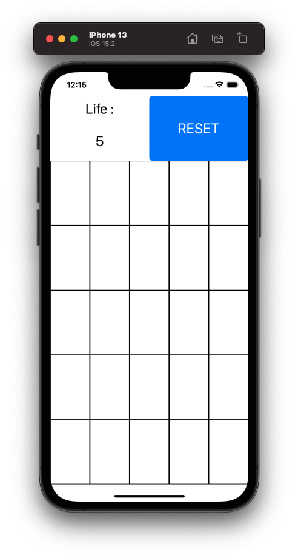
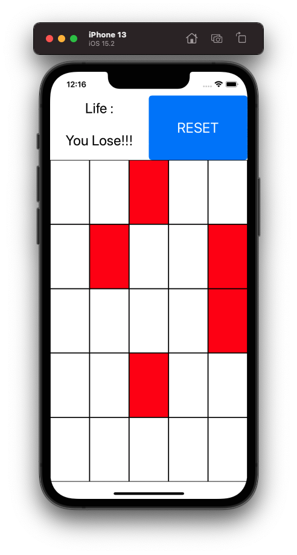
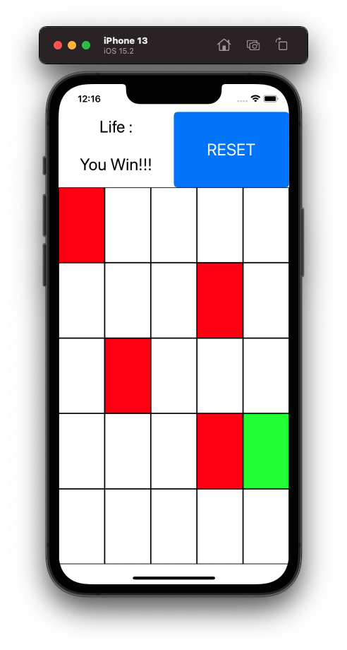

# Guess Box Game
A game that you have five chances to guess the right box from 25 boxes. After every guess, each box is marked as either green or red (green indicates that box is correct and red indicates that box is wrong).

## Preview
  
